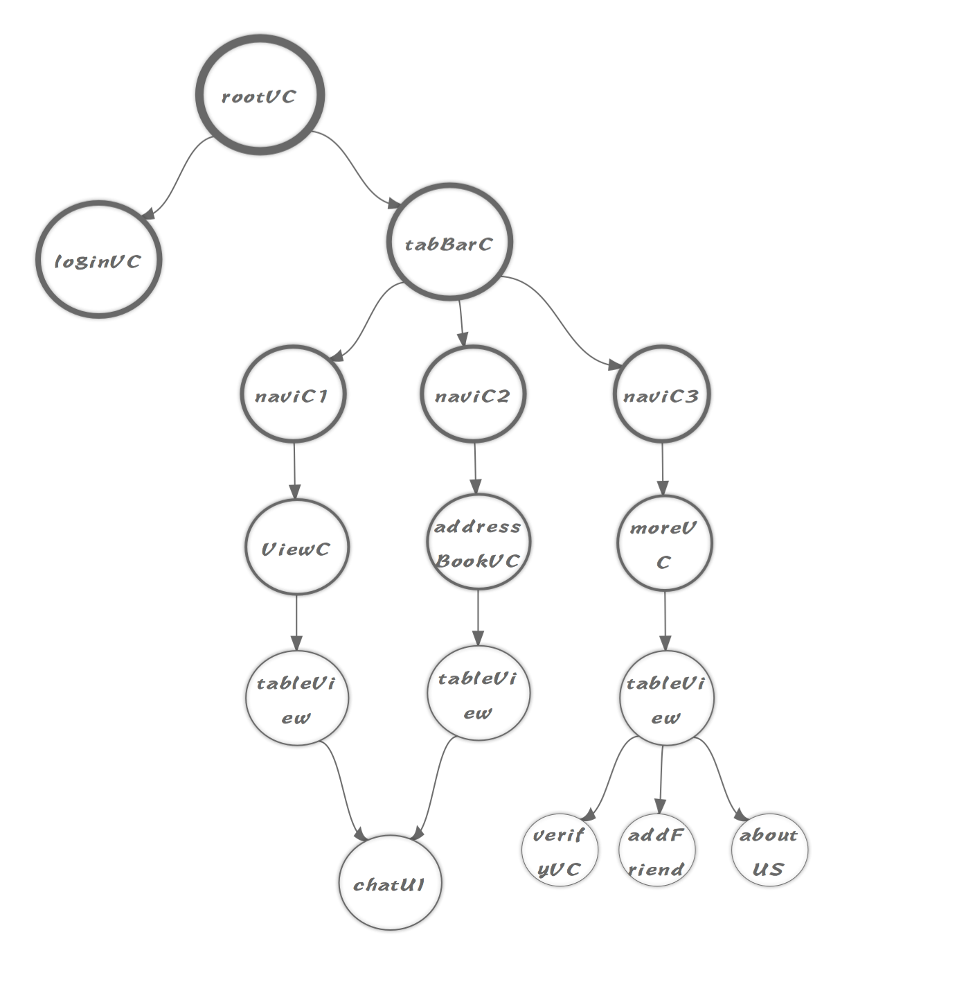
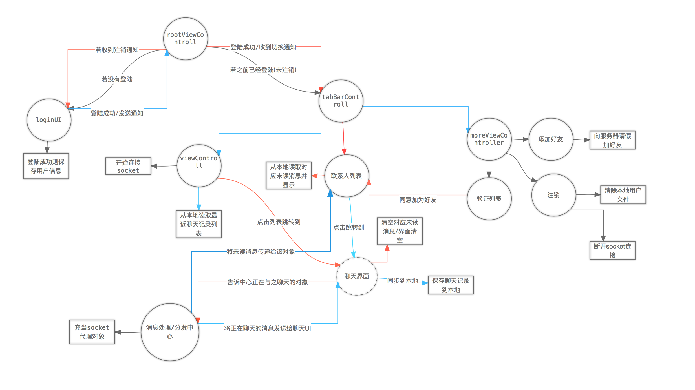

### 项目说明

> 该项目通过swift完成一个具备基本聊天功能的demo
>
> ***具备：***
>
> - 注册
> - 登陆
> - 注销
> - 添加好友
> - 删除好友
> - 好友验证/拒绝
> - 聊天
> - 聊天历史记录
> - 最近聊天记录
>
> > ***暂未完成的功能：***
> >
> > - 通过轮询保持登陆
> > - 拉取离线消息【后台接口完整，暂未整合】

###### 整合的第三方框架有:

-  自动布局 `Snapkit`  
-  键盘管理/键盘遮挡 `IQKeyboardManagerSwift`
-  对象转Json格式 `JsonSerializerSwift`
-  网络处理 `Alamofire`
-  界面指示器 `PKHUD`
-  WebSocket框架 `Starscream`

##### 界面UI组合关系

  

##### 业务逻辑关系

  

